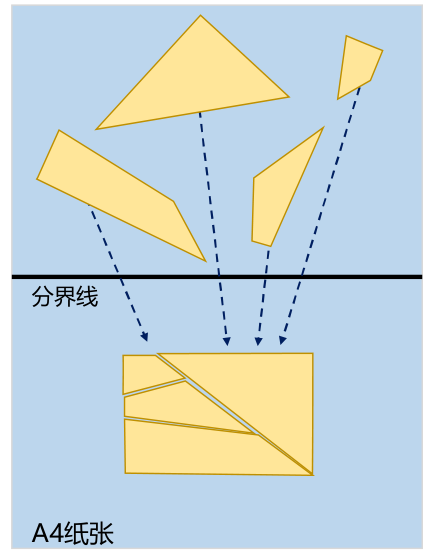
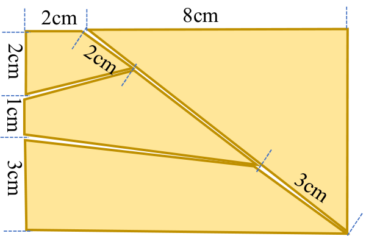

# 2026 年全国大学生电子设计竞赛赛区赛（TI 杯）暨模拟电子系统设计专题赛选拔赛赛题

## 参赛注意事项

1. 7 月 29 日 8:00 竞赛正式开始。每支参赛队可在赛区发布题目中任选一题，必须在竞赛第一天将竞赛选题上报赛区组委会。参赛队中有本科生成员即为本科参赛队，建议赛区对本科组参赛队和高职高专组参赛队分开评审及评奖
2. 参赛队认真填写《登记表》内容，填写好的《登记表》交赛场巡视员暂时保存
3. 参赛者必须是有正式学籍的全日制在校本科、高职高专学生，并出示能够证明参赛者学生身份的有效证件（如学生证）随时备查
4. 每队严格限制 3 人，开赛后不得中途更换队员
5. 竞赛期间，可使用各种图书资料和网络资源，但不得在学校指定竞赛场地外进行设计制作，不得以任何方式与他人交流，包括教师在内的非参赛队员必须迴避，对违纪参赛队取消评审资格
6. 8 月 1 日 20:00 竞赛结束，上交设计报告、制作实物及《登记表》，由专人封存

---

# 拼图装置（E 题）

## 一、任务

设计并制作拼图装置，能够控制机械臂或其他机构移动碎片，最终将所有碎片拼接成目标矩形。图 1 所示的拼图示意图中，拼图区域为纵向 A4 纸张，碎片随机摆放在纸张的上半区域，装置将碎片移动到纸张的下半区域并完成拼图

*图 1 拼图示意图*

## 二、要求

1. 选手自备 A4 纸张和图 2 所示尺寸的 4 片碎片，均要求为纯色。A4 纸张颜色自定，上、下区域有明显的分界线（实线宽度不大于 5 mm）；碎片颜色自定，且 4 片碎片颜色一致；碎片材质不限，厚度不大于 2 mm，其上无任何元器件；碎片移动方式不限。在 2 分钟的时间内一次性完成下面两项操作

   

   *图 2 选手自备碎片*

   1. 装置能将所有碎片从 A4 纸的上半区域移动到 A4 纸的下半区域（20 分）
   2. 装置能将碎片拼接成目标矩形，要求碎片位置正确、碎片不重叠、相邻碎片对应顶点的距离均不大于 2 cm（30 分）

2. 使用选手自备的 A4 纸张，拼接测评现场提供的待拼接碎片。现场提供的待拼接碎片：数量不大于 4 片；每片边数不大于 5 条，每条边长均不小于 2 cm；每片至少有 1 条边位于目标矩形的外边上；碎片由镀锌薄铁片（厚度约 0.3 mm）上面黏贴纸片组成，总厚度不大于 2 mm，重量不大于 30 g。目标矩形的尺寸为 9 cm × 5 cm～12 cm × 9 cm 之间

   1. 测评现场提供的待拼接碎片上的纸片颜色均为白色。装置能将碎片拼接成目标矩形，要求碎片位置正确、碎片不重叠、相邻碎片对应顶点的距离均不大于 2 cm，时间不大于 2 分钟（20 分）
   2. 测评现场提供待拼接碎片上的纸片图案为白底扑克牌牌面。装置能将碎片拼接成目标矩形，要求碎片位置正确、碎片不重叠、相邻碎片的花纹对应正确、相邻碎片对应顶点的距离均不大于 2 cm，时间越短越好、最长不大于 2 分钟（30 分）

3. 设计报告（20 分）

## 三、说明

1. 测评时，先遮挡摄像头，随机不重叠摆放碎片后，再一键启动装置并同时移除遮挡，计时开始；装置自动完成拼接，中途无人工干预；拼接完成后，装置给出声、光等指示，计时结束
2. 装置应能适应正常室内照明环境，测试时不得有特殊照明条件要求

## 四、评分标准

| 项目 | 主要内容 | 说明 | 满分 |
| --- | --- | --- | ---: |
| 设计报告 | 方案论证 | 方案描述、比较与选择 | 4 |
| 设计报告 | 理论分析与计算 | 碎片识别；拼接算法 | 5 |
| 设计报告 | 电路与程序设计 | 电路设计；程序设计 | 5 |
| 设计报告 | 测试方案与测试结果 | 测试方案；测试结果完整性；测试结果分析 | 4 |
| 设计报告 | 设计报告结构及规范性 | 摘要、报告正文结构、公式、图表的完整性和规范性 | 2 |
| 设计报告 | 合计 |  | **20** |
| 要求 | 完成第 1 项 |  | 50 |
| 要求 | 完成第 2 项 |  | 50 |
| 要求 | 合计 |  | **100** |
| **总分** |  |  | **120** |
